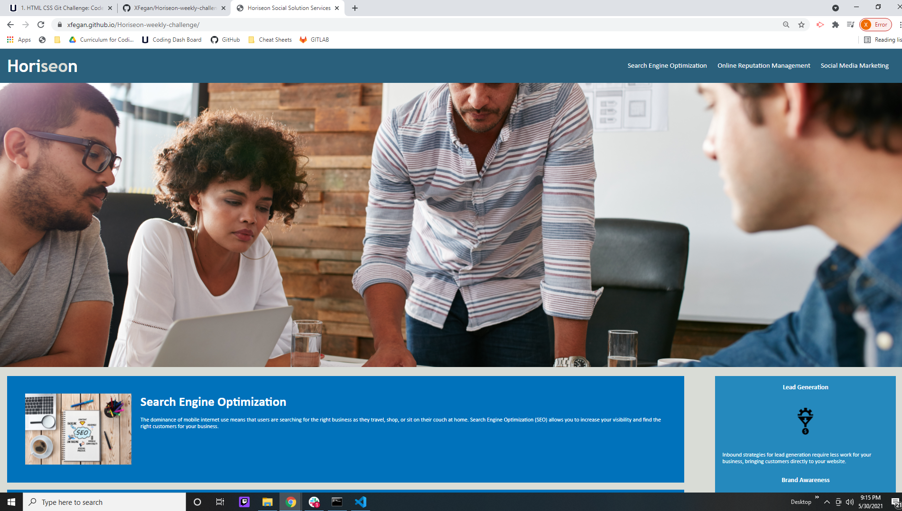

# Horiseon Weekly Challenge

This website is used to market the company and what the best ways to do so. Such as, through social media marketing, brand awarness, SEO, etc. 

What I did to help the website began with changing the div elements to the correct HTML elements. Those elements included elments such as sections, articles, headers, ect. 

I also took the time to leave comments through the index.html and CSS file to explain the correct selectors and what was consolidated to make the file easier to work with.

 
 

https://xfegan.github.io/Horiseon-weekly-challenge/